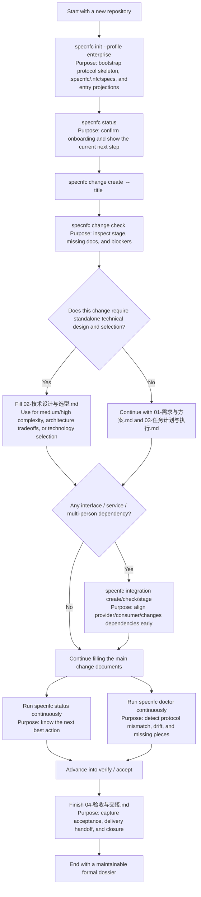
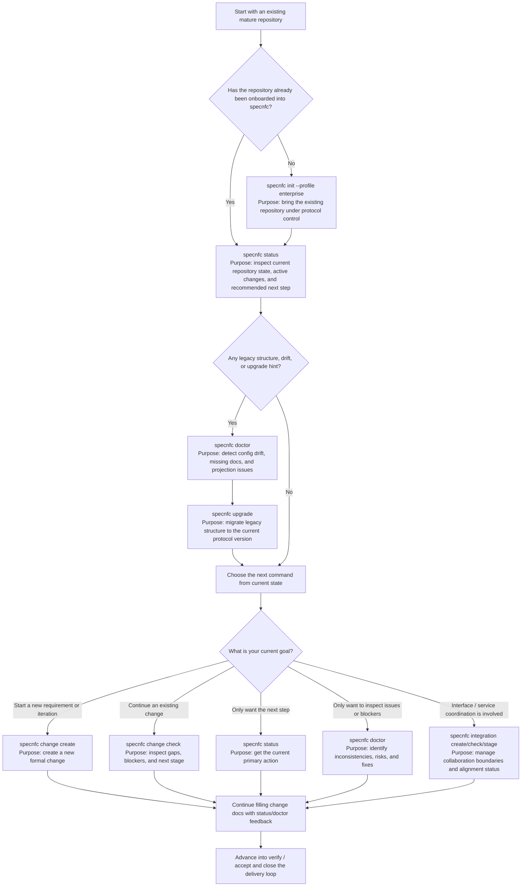

# Spec nfc

[](https://www.npmjs.com/package/spec-nfc)
[](./LICENSE)
[](https://nodejs.org/)

[中文](./README.md) | English

`Spec nfc` is a **Spec-driven Coding protocol system** for team collaboration and AI Agent execution.  
It turns “clarify → solution design → technical design & selection → task planning → execution → verification → delivery handoff” into a repository-native, inspectable, indexable, and upgradable workflow protocol.

[Installation & Quick Start](#installation--quick-start) ·
[Why Spec nfc](#why-spec-nfc) ·
[Core Capabilities](#core-capabilities) ·
[Command System](#command-system) ·
[Directory Model](#directory-model) ·
[Changelog & Releases](#changelog--releases) ·
[Examples](#examples) ·
[Development & Verification](#development--verification) ·
[Contributing](#contributing) ·
[Security](#security)

---

## Why Spec nfc

Traditional “vibe coding” depends heavily on ephemeral conversations and personal habits. That breaks down quickly in multi-person, multi-tool, long-running projects.

`Spec nfc` is designed to make those critical parts explicit and enforceable:

- capture requirements, design, execution, and acceptance as formal repository documents
- make different AI tools collaborate under the same stage machine, document contract, and quality gates
- preserve personal tool freedom while keeping a project-level canonical control plane
- turn `status / doctor / change / integration` into executable team language

Typical scenarios:

- teams that want one protocol for requirement, design, development, testing, and delivery
- projects using multiple AI tools such as Codex, Claude Code, Trae, and OpenCode
- multi-person delivery that needs consistent handling for change / integration / review / handoff
- long-running work that needs repository-native memory instead of one-off chat context

---

## Core Capabilities

| Capability | Description |
| --- | --- |
| Project protocol onboarding | `specnfc init` bootstraps `.specnfc/`, `.nfc/`, and `specs/` into a repository |
| Canonical control plane | `.specnfc/` stores contracts, indexes, rules, skill-pack snapshots, and projection policies |
| Stage-driven change workflow | change objects move through `clarify → design → plan → execute → verify → accept → archive` |
| Integration collaboration object | `integration` manages interface/service alignment, dependencies, blockers, and acceptance |
| Next-step protocol | `specnfc status` shows current stage, missing items, blockers, and recommended next actions |
| Protocol consistency checks | `specnfc doctor` validates documents, projection drift, runtime writeback, and governance rules |
| Chinese skill-pack | built-in workflow/support skills align prompts, writeback, and next-step guidance |
| Conservative upgrade path | `specnfc upgrade` refreshes managed files while preserving conflicts for manual review |

---

## Installation & Quick Start

### Requirements

- Node.js `>= 20`

### Install

Choose one:

#### Option 1: Global install

```bash
npm install -g spec-nfc
specnfc version
specnfc --help
```

#### Option 2: Try directly

```bash
npx --yes spec-nfc@latest version
npx --yes spec-nfc@latest --help
```

#### Option 3: Develop from source

```bash
git clone https://github.com/liubowyf/spec-nfc-cli.git
cd spec-nfc
npm install
npm test
node ./bin/specnfc.mjs --help
```

### Quick Start

#### 1) Initialize repository protocol

```bash
specnfc init --cwd /path/to/repo --profile enterprise
specnfc status --cwd /path/to/repo
```

#### 2) Create the first change

```bash
specnfc change create risk-device-link \
  --cwd /path/to/repo \
  --title "Risk device link enhancement"

specnfc change check risk-device-link --cwd /path/to/repo
```

#### 3) Fill the four primary change documents

Default merged document structure:

1. `01-需求与方案.md`
2. `02-技术设计与选型.md`
3. `03-任务计划与执行.md`
4. `04-验收与交接.md`

#### 4) Create an integration when interface/service alignment is needed

```bash
specnfc integration create account-risk-api \
  --cwd /path/to/repo \
  --provider risk-engine \
  --consumer account-service \
  --changes risk-score-upgrade

specnfc integration check account-risk-api --cwd /path/to/repo
specnfc integration stage account-risk-api --cwd /path/to/repo --to aligned
```

---

## Workflow Diagrams

### New repository: recommended command path from zero to production use

Use this when:

- you are starting from a fresh repository
- you want to know which command comes first and why



How to read it:

- `init`: formally puts the project under protocol control, not just directory setup
- `status`: tells you what to do next
- `change create`: creates a formal work object
- `change check`: tells you what is missing instead of relying on guesswork
- `integration *`: resolves collaboration boundaries when interface or service dependencies exist
- `doctor`: checks what is inconsistent before you keep moving

### Mature repository: how to adopt specnfc and how to choose commands

Use this when:

- the repository is already active or mature
- you are unsure whether to start with `init`, `status`, `doctor`, or `change`
- you want to choose commands based on the current repository state



Command selection guidelines:

- **Do not know what to do first**: run `specnfc status`
- **Suspect structure drift, outdated setup, or projection problems**: run `specnfc doctor`, then `specnfc upgrade` if needed
- **Need to start a new requirement**: run `specnfc change create`
- **Need to continue existing work**: run `specnfc change check <change-id>`
- **Need multi-person interface / service coordination**: run `specnfc integration create/check/stage`
- **Need a quick health signal for the repository**: use `status` together with `doctor`

---

## Command System

### Main commands

```bash
specnfc init
specnfc add
specnfc change
specnfc integration
specnfc status
specnfc doctor
specnfc explain
specnfc upgrade
specnfc demo
specnfc version
```

### Recommended flow

```text
init
  ↓
status
  ↓
change create
  ↓
change check
  ↓
fill documents and advance stages
  ↓
create integration first if there are dependencies
  ↓
close gaps continuously with status / doctor
```

### `status` vs `doctor`

- `status`: tells you **what to do next**
- `doctor`: tells you **what is inconsistent, why you are blocked, and how to fix it**

---

## Directory Model

After initialization, a repository usually contains three object layers:

### `.specnfc/`

The repository’s **canonical control plane**:

- repo contract
- stage machine
- indexes
- governance mode and waivers
- skill-pack snapshots
- multi-tool projection policies

### `.nfc/`

Runtime and collaboration layer:

- interview / clarification notes
- plan scratch and working drafts
- writeback queue and sync status
- session state and handoff records

### `specs/`

Formal dossier layer:

- `specs/changes/<change-id>/`
- `specs/integrations/<integration-id>/`
- `specs/project/summary.md`

In short:

- `.specnfc/` defines how the repository is governed
- `.nfc/` records how work is progressing
- `specs/` stores the long-lived formal outcomes

---

## Multi-tool / Multi-agent Integration

`specnfc` does not bind you to a single tool. After initialization it generates unified entry projections:

- `AGENTS.md`
- `CLAUDE.md`
- `.trae/rules/project_rules.md`
- `opencode.json`

Different tools can keep their own workflows, but they converge on the same:

- repository contracts
- repository indexes
- change / integration dossiers
- document gates
- next-step protocol

---

## Chinese Skill-pack

The default skill-pack is optimized for team collaboration and includes:

### Workflow skills

- requirement clarification
- solution design
- technical design & selection
- task planning
- execution
- verification & acceptance
- delivery handoff
- integration alignment

### Support skills

- context refresh
- decision log
- risk review
- memory sync
- document normalization
- next-step recommendation
- handoff preparation
- release preparation

These skills are governed by repository protocol and document contracts, not by a single runtime brand.

---

## Changelog & Releases

- Changelog: [`CHANGELOG.md`](./CHANGELOG.md)
- GitHub Releases: [`Releases`](https://github.com/liubowyf/spec-nfc-cli/releases)
- npm package: [`spec-nfc`](https://www.npmjs.com/package/spec-nfc)

If you are new to `specnfc`, read in this order:

1. “Installation & Quick Start” in this README
2. the latest version entry in `CHANGELOG.md`
3. the guided sample path below

---

## Examples

Recommended reading path:

### 1. Start with what an initialized repository looks like

- Minimal init sample: [`examples/minimal-init`](./examples/minimal-init)
- Project summary sample after init: [`specs/public-samples/init`](./specs/public-samples/init)

Use these to understand the roles of `.specnfc/`, `.nfc/`, `specs/`, and the generated entry projection files.

### 2. Then inspect how a full change moves through the workflow

- Full change sample: [`specs/public-samples/change-full`](./specs/public-samples/change-full)

Recommended read order:

1. `01-需求与方案.md`
2. `02-技术设计与选型.md`
3. `03-任务计划与执行.md`
4. `04-验收与交接.md`

### 3. Then inspect how interface / service alignment is closed

- Full integration sample: [`specs/public-samples/integration-full`](./specs/public-samples/integration-full)

This is the best place to see how provider / consumer / changes are aligned through the `integration` object.

### 4. If you want to see a fuller demo repository

- Demo output sample: [`examples/demo-output`](./examples/demo-output)

This shows a broader public-facing enterprise-profile structure in one place.

---

## Development & Verification

```bash
npm test
node ./scripts/pack-verify.mjs --json
```

When maintaining the public release surface, verify:

- `pack-verify` assembles and validates `dist/public/npm-publish/`
- public README / examples / public specs remain accurate
- `specnfc --help` and `specnfc explain install` still match the public install flow
- `npm pack --dry-run --json` does not include internal-only paths

---

## Roadmap

The current public release focuses on:

- project protocol onboarding
- change / integration collaboration objects
- multi-layer index and project memory foundations
- Chinese skill-pack
- multi-tool entry projections
- public GitHub + npm distribution

Next iterations will strengthen:

- edge-case and regression examples
- stronger skill governance and recommendation logic
- more complete project / team level indexing practices

---

## Contributing

- Contribution guide: [CONTRIBUTING.md](./CONTRIBUTING.md)
- Issue triage: [.github/ISSUE_TRIAGE.md](./.github/ISSUE_TRIAGE.md)
- Maintainers: [MAINTAINERS.md](./MAINTAINERS.md)

## Support

- Usage help: [SUPPORT.md](./SUPPORT.md)
- Security disclosure: [SECURITY.md](./SECURITY.md)

## Security

See [SECURITY.md](./SECURITY.md).

## License

This project is licensed under the [MIT License](./LICENSE).
