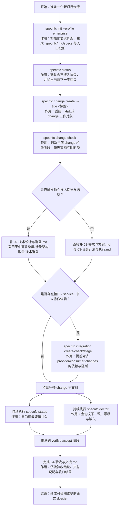
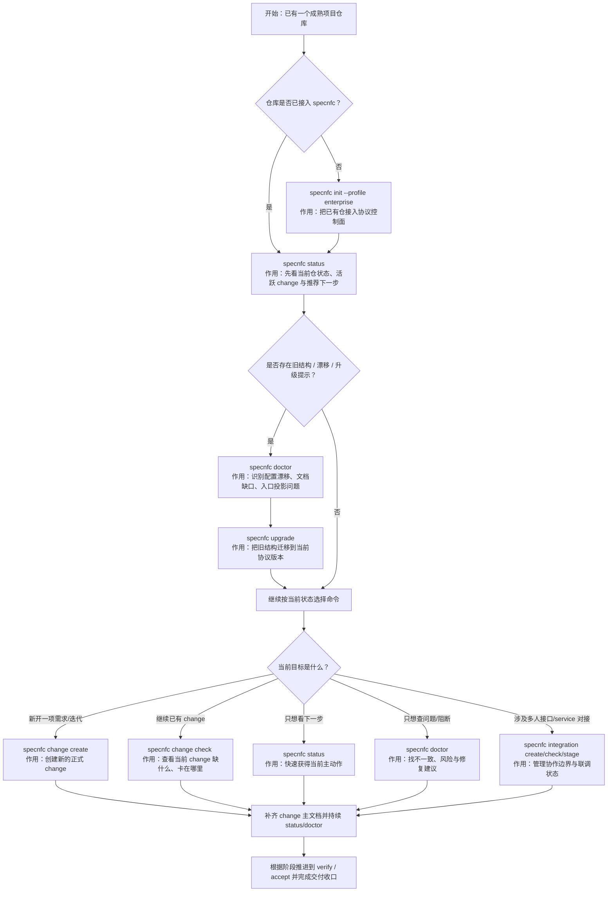

# Spec nfc

[](https://www.npmjs.com/package/spec-nfc)
[](./LICENSE)
[](https://nodejs.org/)

中文 | [English](./README.en.md)

`Spec nfc` 是一个面向团队协作与 AI Agent 落地的 **Spec-driven Coding 协议系统**。  
它把“需求澄清 → 方案设计 → 技术设计与选型 → 任务计划 → 执行实现 → 验证验收 → 交付归档”固化成仓内可检查、可索引、可升级的协作协议。

[安装与快速开始](#安装与快速开始) ·
[为什么使用-spec-nfc](#为什么使用-spec-nfc) ·
[核心能力](#核心能力) ·
[命令体系](#命令体系) ·
[目录结构](#目录结构) ·
[更新记录与-releases](#更新记录与-releases) ·
[示例](#示例) ·
[开发与验证](#开发与验证) ·
[贡献](#贡献) ·
[安全](#安全)

---

## 为什么使用 Spec nfc

传统“Vibe Coding”更依赖即时对话与个人习惯，容易在多人协作、跨工具切换、长期维护时丢失上下文与决策依据。  
`Spec nfc` 的目标是把这些关键过程显式化、结构化、可检查化：

- 让需求、方案、技术设计、执行、验收沉淀为正式文档，而不是散落在聊天记录里
- 让不同 AI 工具进入同一个项目后，围绕同一套阶段机、文档合同与门禁标准协作
- 让团队既保留个人工具自由，也拥有统一的项目级协议控制面
- 让 `status / doctor / change / integration` 成为可执行的协作语言，而不是口头约定

适用场景：

- 希望用统一协议管理需求、设计、开发、测试、交付全过程
- 同一个项目需要同时接入 Codex、Claude Code、Trae、OpenCode 等不同 AI 工具
- 多人并行开发时，需要对 change / integration / review / handoff 做统一收口
- 希望把长期项目记忆、关键决策、阶段状态沉淀在仓内，而不是依赖单次会话上下文

---

## 核心能力

| 能力 | 说明 |
| --- | --- |
| 项目协议接管 | `specnfc init` 初始化 `.specnfc/`、`.nfc/`、`specs/`，把项目接入统一协议 |
| 仓内控制面 | `.specnfc/` 作为 canonical control plane，保存合同、索引、规则、skill-pack 与投影策略 |
| 阶段化 change 流程 | change 按 `clarify → design → plan → execute → verify → accept → archive` 推进 |
| 集成协作对象 | `integration` 统一管理多人接口 / service 对接、联调、阻断与验收 |
| 下一步协议 | `specnfc status` 输出当前阶段、缺失项、阻断项与推荐下一步 |
| 协议一致性校验 | `specnfc doctor` 检查文档完整性、投影漂移、运行时回写与治理规则 |
| 中文 skill-pack | 内置中文 workflow / support skills，把流程提示、回写、下一步建议纳入仓内协议 |
| 保守升级 | `specnfc upgrade` 支持受管文件刷新、冲突跳过、旧仓迁移与结构升级 |

---

## 安装与快速开始

### 环境要求

- Node.js `>= 20`

### 安装

选择一种方式即可：

#### 方式 1：全局安装

```bash
npm install -g spec-nfc
specnfc version
specnfc --help
```

#### 方式 2：直接试用

```bash
npx --yes spec-nfc@latest version
npx --yes spec-nfc@latest --help
```

#### 方式 3：从源码开发

```bash
git clone https://github.com/liubowyf/spec-nfc-cli.git
cd spec-nfc
npm install
npm test
node ./bin/specnfc.mjs --help
```

### 快速开始（项目操作者）

#### 1）初始化项目协议

```bash
specnfc init --cwd /path/to/repo --profile enterprise
specnfc status --cwd /path/to/repo
```

#### 2）创建第一项 change

```bash
specnfc change create risk-device-link \
  --cwd /path/to/repo \
  --title "设备关联风险识别增强"

specnfc change check risk-device-link --cwd /path/to/repo
```

#### 3）按阶段补齐文档

默认 change 主文档结构：

1. `01-需求与方案.md`
2. `02-技术设计与选型.md`
3. `03-任务计划与执行.md`
4. `04-验收与交接.md`

#### 4）存在接口 / service 依赖时创建 integration

```bash
specnfc integration create account-risk-api \
  --cwd /path/to/repo \
  --provider risk-engine \
  --consumer account-service \
  --changes risk-score-upgrade

specnfc integration check account-risk-api --cwd /path/to/repo
specnfc integration stage account-risk-api --cwd /path/to/repo --to aligned
```

---

## 操作流程图

### 新项目：从 0 到 1 的推荐命令链路

适用场景：

- 这是一个全新项目，或你准备把一个新仓按 `specnfc` 方式启动
- 你希望明确知道每一步先执行什么命令、每个命令的意义是什么



推荐理解：

- `init`：让项目正式接入协议，不只是建目录
- `status`：告诉你现在最该做什么
- `change create`：创建正式工作对象
- `change check`：判断当前 change 该补什么，不靠猜
- `integration *`：在多人接口 / service 依赖存在时，先解决协作边界
- `doctor`：在继续推进前查清楚哪里不一致

### 成熟项目：如何接入，以及如何选择命令

适用场景：

- 项目已经在开发，甚至已经很成熟
- 你想知道应该先 `init`、先 `status`、先 `doctor`，还是直接进入 `change`
- 你想根据当前仓状态选择正确命令，而不是机械地全跑一遍



命令选择建议：

- **不知道先做什么**：先跑 `specnfc status`
- **怀疑仓结构不对、升级过期、入口漂移**：跑 `specnfc doctor`，必要时 `specnfc upgrade`
- **要新开需求**：`specnfc change create`
- **要继续已有工作**：`specnfc change check <change-id>`
- **涉及多人接口 / service 协作**：`specnfc integration create/check/stage`
- **只想确认当前仓是不是健康可继续**：`status` + `doctor` 组合看

---

## 命令体系

### 主命令

```bash
specnfc init
specnfc add
specnfc change
specnfc integration
specnfc status
specnfc doctor
specnfc explain
specnfc upgrade
specnfc demo
specnfc version
```

### 推荐主链路

```text
init
  ↓
status
  ↓
change create
  ↓
change check
  ↓
补齐主文档并推进阶段
  ↓
有依赖时创建 integration 并先对齐
  ↓
status / doctor 持续收口
```

### `status` 与 `doctor` 的区别

- `status`：告诉你 **现在最该做什么**
- `doctor`：告诉你 **哪里不一致、为什么不能继续、怎么修**

---

## 目录结构

初始化后的项目通常会看到三类对象：

### `.specnfc/`

仓内 **canonical control plane**，负责：

- repo contract
- 阶段状态机
- 多层索引
- 治理模式与豁免
- skill-pack 快照
- 多工具入口投影策略

### `.nfc/`

运行时与协作层，负责：

- 访谈与澄清记录
- 计划草稿与中间讨论稿
- 写回队列与同步状态
- 会话状态与交接记录

### `specs/`

正式 dossier 层，负责：

- `specs/changes/<change-id>/`
- `specs/integrations/<integration-id>/`
- `specs/project/summary.md`

也就是说：

- `.specnfc/` 决定项目怎么被治理
- `.nfc/` 记录过程如何推进
- `specs/` 保存最终需要长期维护的正式结果

---

## 多工具 / 多 Agent 接入

`specnfc` 不绑定单一工具。初始化后会生成统一入口投影：

- `AGENTS.md`
- `CLAUDE.md`
- `.trae/rules/project_rules.md`
- `opencode.json`

这意味着不同工具可以继续保留自己的工作方式，但最终都要回到同一套：

- 仓内合同
- 仓内索引
- change / integration dossier
- 文档门禁
- 下一步协议

---

## 中文 skill-pack

当前默认 skill-pack 聚焦团队协作主链路，包含：

### 阶段技能（workflow skills）

- 需求澄清
- 方案设计
- 技术设计与选型
- 任务规划
- 执行落地
- 验证验收
- 交付归档
- 集成对齐

### 辅助技能（support skills）

- 上下文刷新
- 决策记录
- 风险复核
- 记忆同步
- 文档规范化
- 下一步推荐
- 交接整理
- 发布准备

这些技能不依赖单一运行时品牌，而是通过仓内协议与文档合同统一约束。

---

## 更新记录与 Releases

- 更新记录：[`CHANGELOG.md`](./CHANGELOG.md)
- GitHub Releases：[`Releases`](https://github.com/liubowyf/spec-nfc-cli/releases)
- npm 页面：[`spec-nfc`](https://www.npmjs.com/package/spec-nfc)

如果你是第一次接触 `specnfc`，建议优先看：

1. 当前 README 的“安装与快速开始”
2. `CHANGELOG.md` 中最新版本说明
3. 下方“示例”中的阅读路径

---

## 示例

推荐按下面顺序阅读：

### 1. 先看初始化后项目长什么样

- 最小初始化示例：[`examples/minimal-init`](./examples/minimal-init)
- 初始化后的 project 摘要样例：[`specs/public-samples/init`](./specs/public-samples/init)

适合先理解：`.specnfc/`、`.nfc/`、`specs/`、入口投影文件分别扮演什么角色。

### 2. 再看一条完整的 change 如何推进

- 完整 change 样例：[`specs/public-samples/change-full`](./specs/public-samples/change-full)

建议阅读顺序：

1. `01-需求与方案.md`
2. `02-技术设计与选型.md`
3. `03-任务计划与执行.md`
4. `04-验收与交接.md`

### 3. 最后看多人接口 / service 对接如何收口

- 完整 integration 样例：[`specs/public-samples/integration-full`](./specs/public-samples/integration-full)

适合理解 provider / consumer / changes 之间如何通过 `integration` 对象对齐状态与阻断。

### 4. 如果你想直接看完整演示仓

- demo 输出示例：[`examples/demo-output`](./examples/demo-output)

这适合一次性看到 enterprise profile 下更完整的公开结构。

---

## 开发与验证

```bash
npm test
node ./scripts/pack-verify.mjs --json
```

如果你在维护公开发布面，重点检查：

- `pack-verify` 默认会自动装配并验证 `dist/public/npm-publish/`
- 公开 README / examples / specs 样例是否仍然准确
- `specnfc --help`、`specnfc explain install` 是否与公开安装路径一致
- `npm pack --dry-run --json` 是否没有把内部路径打进包内

---

## Roadmap

当前公开版本重点覆盖：

- 项目级协议接入
- change / integration 协作对象
- 多层索引与项目记忆骨架
- 中文 skill-pack
- 多工具入口投影
- 公开发布与 npm 分发

后续会继续补强：

- 更细粒度的异常路径与回归样例
- 更强的 skill 治理与推荐能力
- 更完整的项目 / 团队层索引协作实践

---

## 贡献

- 贡献说明：[CONTRIBUTING.md](./CONTRIBUTING.md)
- Issue triage：[.github/ISSUE_TRIAGE.md](./.github/ISSUE_TRIAGE.md)
- 维护者说明：[MAINTAINERS.md](./MAINTAINERS.md)

## 支持

- 使用帮助：[SUPPORT.md](./SUPPORT.md)
- 安全披露：[SECURITY.md](./SECURITY.md)

## 安全

安全披露流程见 [SECURITY.md](./SECURITY.md)。

## 许可证

本项目使用 [MIT License](./LICENSE)。
